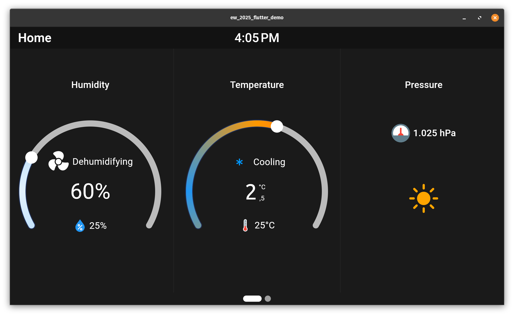
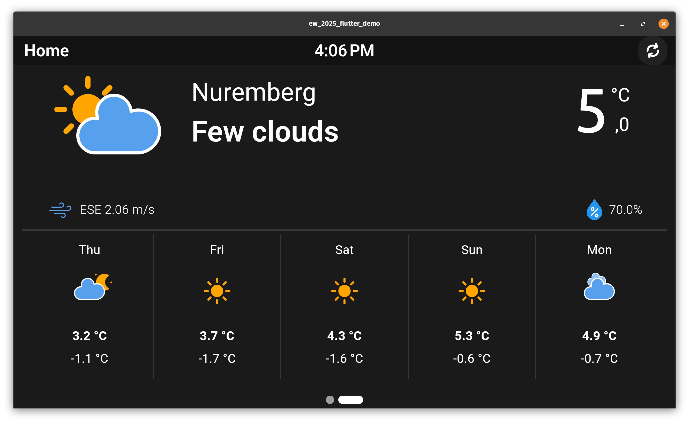

# ew_2025_flutter_demo

Flutter thermostat demo for Embedded World 2025

# Run on Target

```shell
export FLUTTER_TAG=$( (cd /usr/share/flutter/ && printf -- '%s\n' */) | head -n 1)
export LD_LIBRARY_PATH=$LD_LIBRARY_PATH:/usr/share/flutter/"$FLUTTER_TAG"/release/lib/
flutter-client -f -b /usr/share/flutter/ew_2025_flutter_demo/3.27.1/release/
```


---
